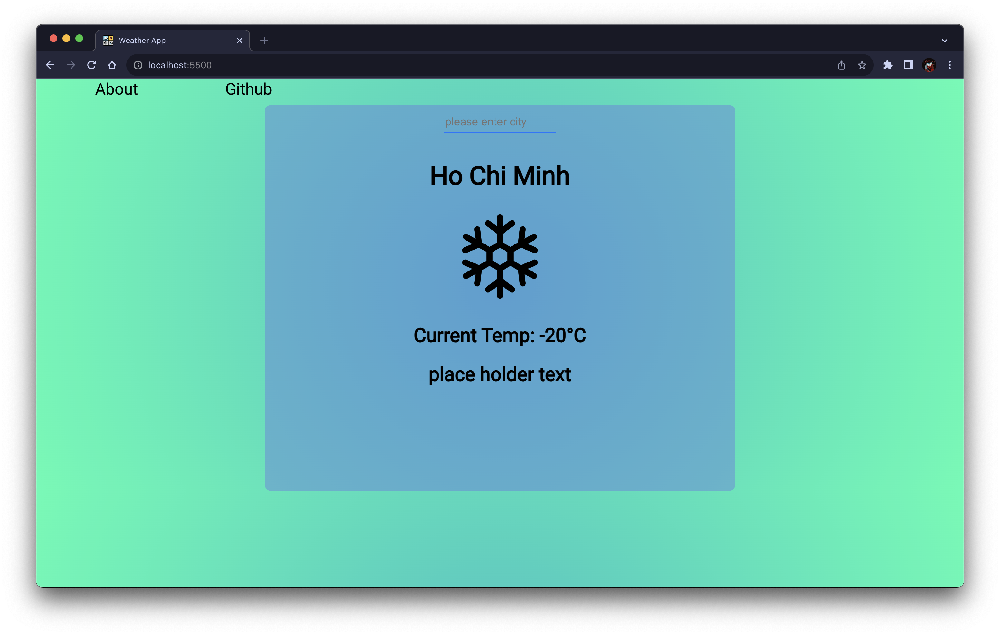

# Weather App
  

A Weather Application built with HTML And CSS, With Backend built with Javascript. This application can get real time weather infomations of any locations, and weather in-day and weelky forecast.

[Try Now](https://johnnybinh.github.io/gdsc-g4-weatherapp/)

**Created By:**

[**@johnnybinh**](https://github.com/johnnybinh)

[**@HariusNguyen**](https://github.com/johnnybinh/gdsc-g4-weatherapp/commits?author=HariusNguyen "View all commits by HariusNguyen")

[**@hwHoai**](https://github.com/hwHoai)

## Images:

